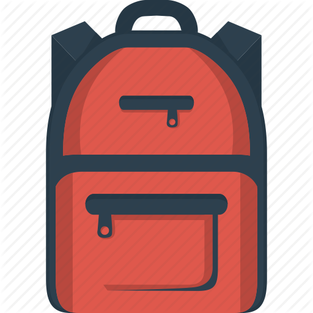

  <h1>
    
     
   Some Reusable UI components (Pure)
     
     
  </h1>

- `Table` &mdash; Customziable table component
- `Skeleton` &mdash; Nice and easy to use skeleton component (You don't need any lib for this!!!)
- `Count Down` &mdash; Easy to use and accepts callback
- `Input` &mdash; Highly customziable with mulitle support
- `Txt` &mdash; Custom text which you can pass the tag as props to it 
- `Carousel` &mdash; Nice and pure component with bullets and touch support
- `Map` &mdash; Reusable map component with marker (using React-Leaflet)

